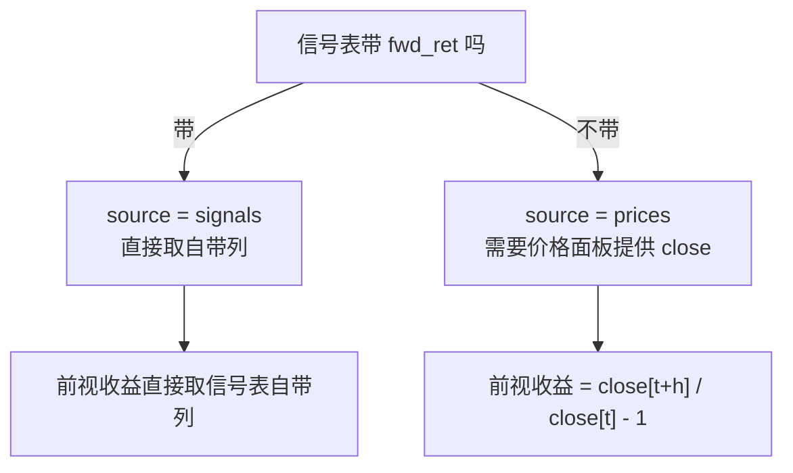

# 准备输入数据

包内没有任何硬编码路径与列名。数据从哪来、列叫什么，全部由调用方给出，工具包负责标准化成统一契约。

## 三类输入

| 输入 | 必需列 | 是否必需 |
|---|---|---|
| 信号 | `date`、`id`、`alpha` | 必需，至少一路 |
| 价格面板 | `date`、`id` | 必需 |
| 基准 | `date`、`ret` | 可选 |

价格面板的 `close` 与 `cap` 都是可选列，各自只在特定场景下需要——见下文。

## 数据可以不落盘

内存中的 DataFrame 与磁盘上的文件是对等的输入，两者走同一条处理链路：

```python
bt = alp.backtest(signals=alpha_df, prices=price_df, horizon=5)          # 内存
bt = alp.backtest(signals="mom.feather", prices="px.feather", horizon=5) # 文件
```

文件内置支持 `feather`、`parquet`、`csv` 三种格式，按后缀推断。

因子刚在 notebook 里算完就在内存里，直传省掉了一次落盘与读回。扫参数时这个差别会放大——
试五个不同的回看窗口，不必写五个中间文件。

---

## 信号表

一张信号表就是「含因子值的长表」，每个 `(date, id)` 一行。最小形态四列：

| 列 | dtype | 契约列名 | 说明 |
|---|---|---|---|
| `date` | 日期 | `date` | 调仓日 |
| `id` | 任意 | `id` | 资产标识，包内统一转字符串 |
| `alpha` | 数值 | `alpha` | 因子值 |
| `fwd_ret` | 数值 | `fwd_ret` | 可选，自带的前视收益 |

列名已经是这四个时无需任何声明：

```python
alp.backtest(signals=alpha_df, prices=price_df, horizon=5)
```

## 列名不一致时

源表列名叫什么都可以，用 `signal_columns` 声明映射即可，写法为 `{"契约列名": "源表列名"}`：

=== "Python API"

    ```python
    alp.backtest(
        signals=pred_df,
        prices=price_df,
        horizon=5,
        signal_columns={"date": "anchor_date", "id": "permno", "alpha": "pred_score"},
    )
    ```

    另有 `price_columns` 与 `reference_columns`，语义相同。

=== "配置目录"

    ```json
    {
      "name": "MOM",
      "path": "${DATA}/signal_mom.feather",
      "column_map": {
        "date": "anchor_date",
        "id": "permno",
        "alpha": "pred_score"
      }
    }
    ```

!!! warning "映射一旦声明，就要声明完整"

    映射整体留空时按契约列名自动识别；**一旦写了内容就进入显式模式，未声明的列一律不取**，
    即使源表里有同名列。

    这不是疏漏而是刻意设计：在显式模式下遗漏某列是有意义的声明。价格面板不映射 `close`
    正是「本面板无可用价格序列」的表达方式（见下文）。若改成逐列补全，这个开关就没法表达了。

    因此 `{"date": "anchor_date"}` 这样只写一项的映射会让 `id` 与 `alpha` 一并落空并报错，
    而不是「只改 date、其余自动」。

!!! info "本包只消费 alpha，不生成信号"

    MOM / STR / WSTR 这类价格因子属于普通输入，与任何外部 alpha 同等对待。生成方式参见仓库中的 `examples/build_jkx_factors.py`。

---

## 两种前视收益口径

这是准备数据时最需要先定下来的一件事。



=== "信号口径"

    信号表自带 `fwd_ret`。价格面板只承担关联市值与定义交易日历两件事。

    ```python
    # 信号表有 fwd_ret 列时，这是自动推导的结果，无需声明
    alp.backtest(signals=pred_df, prices=price_df, horizon=5)
    ```

    ```json
    // engine.json
    "forward_return": { "horizon": 5, "source": "signals" }
    ```

    此时信号必须提供 `fwd_ret`，否则抛 `ContractError`。

=== "价格口径"

    信号表不带 `fwd_ret`，由价格面板的 `close` 逐资产计算 `close[t+h] / close[t] - 1`。

    ```python
    # 信号表没有 fwd_ret 列时，这是自动推导的结果
    alp.backtest(signals=alpha_df, prices=price_df, horizon=5)

    # 信号表有 fwd_ret 但仍要走价格口径，需显式指定
    alp.backtest(..., forward_return_source="prices")
    ```

    ```json
    // engine.json
    "forward_return": { "horizon": 5, "source": "prices" }
    ```

    信号若也提供了 `fwd_ret`，该列被丢弃并发出 `IgnoredForwardReturnWarning`。

!!! note "为什么自带列优先于 close"

    两者的明确程度不对等。`fwd_ret` 是使用者专门算过一遍实现收益的结果，常含分红与拆股调整；
    而 `close` 往往只是价格面板顺带提供的——那张表本来就要承担交易日历与市值关联两项职责，
    有没有 `close` 说明不了口径意图。

    优先取 `close` 会把那一列算好的收益静默丢掉。这不是小差别：下一节的实测案例里，
    两种口径能让同一期的多空腿从 −1.76% 变成 −141.17%。

!!! warning "不要用占位列冒充 close"

    为了通过校验而填一列常数作为 `close`，会让前视收益恒为 0，据此得到的组合收益、净值与所有指标都没有意义。

    这种情况会触发 `DegeneratePriceWarning`。正确做法是不映射 `close` 并改用信号口径。

### 收益口径的一个真实陷阱

若价格面板的 `close` 是**未复权原始价**，拆股与缩股会让它跳变。仓库中 `examples/mom/README.md` 记录了一个实测案例：某只股票反向缩股 1:100 后，`close` 从 $0.0383 跳到 $11.50，按价格口径算出 **+25931%** 的假收益，在 493 只等权桶里单独贡献 +64% 的组合收益，使该期多空腿从 −1.76% 变成 −141.17%。

结论是：用于计算实现收益的价格序列应当是**复权总收益口径**（含分红），而因子本身用什么价格是另一回事。两者可以不同——这正是信号口径存在的意义：因子与收益各自用各自合适的口径，在信号生成阶段就算好 `fwd_ret`。

自带列优先于 `close` 的推导规则正是为此：既然已经专门算过一遍，就不该被原始 `close` 悄悄覆盖。

---

## 价格面板

每个 `(date, id)` 一行，存在重复时抛 `ContractError`——重复会让市值关联膨胀。

| 列 | 何时需要 | 缺失时 |
|---|---|---|
| `date`、`id` | 始终需要 | 报错 |
| `close` | 仅价格口径时 | 自动改走信号口径（若信号带 `fwd_ret`） |
| `cap` | 仅市值加权时 | `weights` 自动退化为 `["ew"]` |

即使 `close` 与 `cap` 都不需要，价格面板本身仍是必需的——它定义了交易日历，`auto_stride`
与重叠窗口检测都依赖它。

### cap 决定有没有市值加权

`backtest()` 按价格面板是否提供 `cap` 决定 `weights`：有则 `["ew", "vw"]`，无则 `["ew"]`。

无市值数据时若仍把 `vw` 排进去，市值加权会产出整列 NaN 而不报错——一张看似正常、
实则全空的结果表。显式给出 `weights=["ew", "vw"]` 可以覆盖这一推导。

### close 的三种状态

| 映射中的 `close` | 行为 |
|---|---|
| 已声明且源列存在 | 正常读取 |
| 未声明（显式模式下） | 视为「无价格序列」，`close` 整列为 NaN |
| 已声明但源列不存在 | 抛 `ContractError` |

第三种不会被当成第二种静默处理：拼写错误不应被降级成「没有这一列」。

第二种仅在**显式模式**下成立。映射整体留空时走自动识别，源表中恰有 `close` 列就会被取用。
要在自动识别的场景下排除 `close`，显式给出不含它的映射即可：

```python
alp.backtest(..., price_columns={"date": "date", "id": "id", "cap": "cap"})
```

---

## 基准

可选。这里声明的基准会进入结果表，`bucket` 为 `REF`。

=== "Python API"

    ```python
    alp.backtest(
        signals=alpha_df, prices=price_df, horizon=5,
        references={"SPX": spx_df},          # 或 {"SPX": "spx_daily.csv"}
        reference_frequency="daily",
    )
    ```

=== "配置目录"

    ```json
    "references": [
      {
        "name": "SPX",
        "path": "${DATA}/spx_daily.csv",
        "column_map": { "date": "date", "ret": "ret" },
        "frequency": "daily"
      }
    ]
    ```

`frequency` 只能取两值：`daily` 表示日频收益，需按持有期复利；`period` 表示已是周期收益，直接按调仓日历对齐。

基准只需两列：日期与该日收益率。列名已是 `date` / `ret` 时无需声明映射。

!!! info "市场指数数据需自行准备"

    包内不附带任何市场指数数据，基准全部经由此处声明。数据只需两列：日期与该日收益率，列名通过 `column_map` 映射。

    声明后基准即进入结果表。要让它同时出现在图上，需把 `"REF"` 列入 `visualizer.charts[].buckets`。

---

## 路径与变量

`path` 支持 `${VAR}` 展开，取值顺序为：先查配置的 `vars`，再查环境变量，两处都没有则抛 `KeyError`。

```json
{
  "vars": { "DATA": "/mnt/research/panels" },
  "signals": [{ "path": "${DATA}/signal_mom.feather", "...": "..." }]
}
```

把机器相关的根目录收进 `vars`，同一份配置就能在不同机器间直接复用。

`format` 留空时按后缀推断（`.csv.gz` 读作 `csv`），无法推断时需显式指定。

---

## 数据类型归一

读入后统一归一，不依赖源文件的 dtype：

| 列 | 归一规则 |
|---|---|
| `date` | 转 `datetime64[ns]`，无法解析的值变 `NaT` |
| `id` | 转字符串。浮点型 ID 先四舍五入再转整数再转字符串 |
| `alpha`、`fwd_ret`、`close`、`cap`、`ret` | 转 `float64`，无法解析的值变 `NaN` |

!!! note "浮点型 ID 为何要先归整"

    资产 ID 若以浮点存储，`1001.0` 直接转字符串会得到 `"1001.0"`，与另一处的 `"1001"` 对不上，导致 merge 静默丢行。先四舍五入再转整数可避免这种错位。

---

## 性能：列名先校验，再按列读取

列名校验在**读取整表之前**完成：先只读表头（feather 与 parquet 走 Arrow footer，10GB 级面板也是常数开销），确认所需源列都存在，再把列清单下推给读取函数，只加载用到的列。

价格面板还会额外按首个调仓日截断、并按信号中出现的资产过滤（`restrict_to_signal_assets`，默认打开）——前视收益只往后取数，不需要历史缓冲。

因此配置错列名时，报错发生在几秒内，而不是在加载完整块面板之后。

---

## 常见错误

| 报错 | 原因 |
|---|---|
| `缺少必需列 [...]；源列为 [...]` | 源表没有同名的契约列，且未声明映射；或声明了映射但漏了必需列 |
| `源列 [...] 不存在；实际列为 [...]` | 映射中的源表列名拼错 |
| `path 与 frame 只能给一个` | 同时给了文件路径与内存 DataFrame |
| `必须给出 path 或 frame` | 两者都没给，没有数据来源 |
| `价格面板存在 N 行重复的 (date, asset)` | 价格面板未去重 |
| `价格面板在过滤后为空` | 资产过滤或日期截断后没有剩余数据 |
| `input.signals 存在重名` | 多路信号用了相同的名字 |
| `调仓日历为空` | `first_rebalance` / `last_rebalance` 与数据区间不重叠 |
| `信号在调仓日历上没有任何记录` | 信号日期与日历对不上 |
| `路径变量 ${X} 未定义` | `vars` 与环境变量中都没有该变量 |

报错信息一律带上源表的实际列名，因此列名对不上时不需要回去翻数据：

```
ContractError: frame<MOM>: 缺少必需列 ['date', 'id']；源列为 ['anchor', 'sym', 'alpha']。
源列名与之不同时请用 column_map 声明映射。
```

上下文前缀标明了是哪一路数据出的问题：内存表为 `frame<信号名>`，文件为文件名。

## 下一步

- [多信号](multi-signal.md)：一次跑多路 alpha
- [Python API 参考](../reference/api.md)：`backtest()` 的逐参数说明
- [input.json 完整字段参考](../reference/config-input.md)
