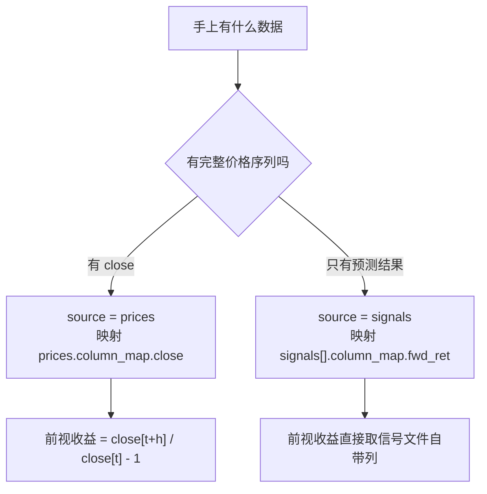

# 准备输入数据

包内没有任何硬编码路径与列名。配置指向文件、声明 `column_map`，工具包负责把它们标准化成统一契约。

内置支持 `feather`、`parquet`、`csv` 三种格式。

## 三类输入

| 输入 | 映射后必需列 | 是否必需 |
|---|---|---|
| `signals[]` | `date`、`id`、`alpha` | 必需，至少一项 |
| `prices` | `date`、`id` | 必需 |
| `references[]` | `date`、`ret` | 可选 |

`prices` 的 `close` 与 `cap` 都是可选列，各自只在特定场景下需要——见下文。

---

## 信号表

一张信号表就是「含因子值的长表」，每个 `(date, id)` 一行。最小形态四列：

| 列 | dtype | 映射到 | 说明 |
|---|---|---|---|
| `date` | 日期 | `date` | 调仓日 |
| `id` | 任意 | `id` | 资产标识，包内统一转字符串 |
| `alpha` | 数值 | `alpha` | 因子值 |
| `fwd_ret` | 数值 | `fwd_ret` | 可选，自带的前视收益 |

对应配置：

```json
{
  "name": "MOM",
  "path": "${DATA}/signal_mom.feather",
  "column_map": {
    "date": "date",
    "id": "id",
    "alpha": "alpha",
    "fwd_ret": "fwd_ret"
  }
}
```

`column_map` 的写法是 `{"包内列名": "源文件列名"}`。源文件列名叫什么都可以，映射过去即可：

```json
"column_map": {
  "date": "anchor_date",
  "id": "permno",
  "alpha": "pred_score"
}
```

!!! info "本包只消费 alpha，不生成信号"

    MOM / STR / WSTR 这类价格因子属于普通输入，与任何外部 alpha 同等对待。生成方式参见仓库中的 `examples/build_jkx_factors.py`。

---

## 两种前视收益口径

这是准备数据时最需要先定下来的一件事，它决定了价格面板要不要带 `close`。



=== "价格口径"

    价格面板提供 `close`，工具包逐资产计算 `close[t+h] / close[t] - 1`。

    ```json
    // input.json
    "prices": {
      "column_map": { "date": "date", "id": "id", "close": "close", "cap": "cap" }
    }
    ```

    ```json
    // engine.json
    "forward_return": { "horizon": 5, "source": "prices" }
    ```

    信号文件若也映射了 `fwd_ret`，该列被丢弃并发出 `IgnoredForwardReturnWarning`。

=== "信号口径"

    只有预测结果、没有价格序列时使用。价格面板只承担关联市值与定义交易日历两件事。

    ```json
    // input.json —— 注意 column_map 里不写 close
    "prices": {
      "column_map": { "date": "date", "id": "id", "cap": "cap" }
    }
    ```

    ```json
    // engine.json
    "forward_return": { "horizon": 5, "source": "signals" }
    ```

    此时信号的 `column_map` 必须映射 `fwd_ret`，否则抛 `ContractError`。

!!! warning "不要用占位列冒充 close"

    为了通过校验而填一列常数作为 `close`，会让前视收益恒为 0，据此得到的组合收益、净值与所有指标都没有意义。

    这种情况会触发 `DegeneratePriceWarning`。正确做法是不映射 `close` 并改用信号口径。

### 收益口径的一个真实陷阱

若价格面板的 `close` 是**未复权原始价**，拆股与缩股会让它跳变。仓库中 `examples/mom/README.md` 记录了一个实测案例：某只股票反向缩股 1:100 后，`close` 从 $0.0383 跳到 $11.50，按价格口径算出 **+25931%** 的假收益，在 493 只等权桶里单独贡献 +64% 的组合收益，使该期多空腿从 −1.76% 变成 −141.17%。

结论是：用于计算实现收益的价格序列应当是**复权总收益口径**（含分红），而因子本身用什么价格是另一回事。两者可以不同——这正是 `forward_return.source="signals"` 存在的意义：因子与收益各自用各自合适的口径，在信号生成阶段就算好 `fwd_ret`。

---

## 价格面板

每个 `(date, id)` 一行，存在重复时抛 `ContractError`——重复会让市值关联膨胀。

| 列 | 何时需要 |
|---|---|
| `date`、`id` | 始终需要 |
| `close` | 仅 `forward_return.source="prices"` 时 |
| `cap` | 仅使用市值加权（`vw`）时 |

即使两者都不需要，价格面板本身仍是必需的——它定义了交易日历，`auto_stride` 与重叠窗口检测都依赖它。

### close 的三种状态

| `column_map` 中的 `close` | 行为 |
|---|---|
| 已声明且源列存在 | 正常读取 |
| 未声明 | 视为「无价格序列」，`close` 整列为 NaN |
| 已声明但源列不存在 | 抛 `ContractError` |

第三种不会被当成第二种静默处理：拼写错误不应被降级成「没有这一列」。

---

## 基准

可选。这里声明的基准会进入结果表，`bucket` 为 `REF`。

```json
"references": [
  {
    "name": "SPX",
    "path": "${DATA}/spx_daily.csv",
    "column_map": { "date": "date", "ret": "ret" },
    "frequency": "daily"
  }
]
```

`frequency` 只能取两值：`daily` 表示日频收益，需按持有期复利；`period` 表示已是周期收益，直接按调仓日历对齐。

!!! info "市场指数数据需自行准备"

    包内不附带任何市场指数数据，基准全部经由此处声明。数据只需两列：日期与该日收益率，列名通过 `column_map` 映射。

    声明后基准即进入结果表。要让它同时出现在图上，需把 `"REF"` 列入 `visualizer.charts[].buckets`。

---

## 路径与变量

`path` 支持 `${VAR}` 展开，取值顺序为：先查配置的 `vars`，再查环境变量，两处都没有则抛 `KeyError`。

```json
{
  "vars": { "DATA": "/mnt/research/panels" },
  "signals": [{ "path": "${DATA}/signal_mom.feather", "...": "..." }]
}
```

把机器相关的根目录收进 `vars`，同一份配置就能在不同机器间直接复用。

`format` 留空时按后缀推断（`.csv.gz` 读作 `csv`），无法推断时需显式指定。

---

## 数据类型归一

读入后统一归一，不依赖源文件的 dtype：

| 列 | 归一规则 |
|---|---|
| `date` | 转 `datetime64[ns]`，无法解析的值变 `NaT` |
| `id` | 转字符串。浮点型 ID 先四舍五入再转整数再转字符串 |
| `alpha`、`fwd_ret`、`close`、`cap`、`ret` | 转 `float64`，无法解析的值变 `NaN` |

!!! note "浮点型 ID 为何要先归整"

    资产 ID 若以浮点存储，`1001.0` 直接转字符串会得到 `"1001.0"`，与另一处的 `"1001"` 对不上，导致 merge 静默丢行。先四舍五入再转整数可避免这种错位。

---

## 性能：列名先校验，再按列读取

列名校验在**读取整表之前**完成：先只读表头（feather 与 parquet 走 Arrow footer，10GB 级面板也是常数开销），确认所需源列都存在，再把列清单下推给读取函数，只加载用到的列。

价格面板还会额外按首个调仓日截断、并按信号中出现的资产过滤（`restrict_to_signal_assets`，默认打开）——前视收益只往后取数，不需要历史缓冲。

因此配置错列名时，报错发生在几秒内，而不是在加载完整块面板之后。

---

## 常见错误

| 报错 | 原因 |
|---|---|
| `column_map 缺少必需映射 [...]` | 必需列没写进 `column_map` |
| `源列 [...] 不存在；实际列为 [...]` | 映射的源文件列名拼错 |
| `价格面板存在 N 行重复的 (date, asset)` | 价格面板未去重 |
| `价格面板在过滤后为空` | 资产过滤或日期截断后没有剩余数据 |
| `input.signals 存在重名` | 多路信号用了相同的 `name` |
| `调仓日历为空` | `first_rebalance` / `last_rebalance` 与数据区间不重叠 |
| `信号在调仓日历上没有任何记录` | 信号日期与日历对不上 |
| `路径变量 ${X} 未定义` | `vars` 与环境变量中都没有该变量 |

## 下一步

- [多信号](multi-signal.md)：一次跑多路 alpha
- [input.json 完整字段参考](../reference/config-input.md)
