# 快速开始

工具包有两条对等的入口——交互式分析用 Python API，批量执行与复现归档用配置目录。两者共用同一套
校验与计算，结果逐值一致。

本页两个例子各自独立：月频面板三路 alpha 同跑，日频面板单路 alpha 配两条基准。每行代码后面紧跟
它产出的那张图或那张表，产出与代码在同一处，不另设汇总章节。

## 安装

```bash
pip install alpholio
```

需要 Python 3.10 及以上——`pyproject.toml` 声明 `requires-python = ">=3.10"`，CI 在 3.10 / 3.11 /
3.12 / 3.13 四个版本上逐一跑安装与导入冒烟。安装后会注册命令行入口 `alpholio`。

## 输入可以是什么

三类输入，各自的必需列：

| 输入 | 必需列 | 可选列 |
|---|---|---|
| 信号 | `date`、`id`、`alpha` | `fwd_ret`（自带实现收益时） |
| 价格面板 | `date`、`id` | `close`（价格口径时必需）、`cap`（市值加权时必需） |
| 基准 | `date`、`ret` | — |

每类输入都接受两种形态，两者对等且可在同一次回测里混用：

| 形态 | 写法 | 说明 |
|---|---|---|
| 内存 DataFrame | `signals=alpha_df` | 不必先落盘 |
| 磁盘文件 | `signals="alpha.feather"` | 格式按后缀推断 |

按后缀推断的格式：

| 后缀 | 读取方式 |
|---|---|
| `.feather` | feather |
| `.parquet`、`.pq` | parquet |
| `.csv`、`.txt`、`.csv.gz`、`.csv.zip` | csv（压缩包由 pandas 直接解开） |

后缀不在表内或需要覆盖推断时，在 `SignalSpec` / `PriceSpec` / `ReferenceSpec` 的 `format` 字段
显式写格式名。自定义格式可注册进 `ALPHA_SOURCES` 等注册表，见[核心概念](concepts.md#扩展点)。

源表列名已是 `date` / `id` / `alpha` 这类契约列名时无需声明映射；不一致时用 `column_map`
（JSON）或 `signal_columns` / `price_columns` / `reference_columns`（Python API）指明。

!!! tip "文档中的数据位置是占位符"

    包内与文档内都不含任何本机绝对路径，数据位置一律写作 `/path/to/...`，运行前需指向实际位置。
    JSON 配置用 `vars` 块统一换根目录。两个例子不附带数据文件。

---

## 月频：三路 alpha 同跑

一张月频面板同时充当三路信号与市值来源，每月调仓一次。区间 1998-01 至 2024-11 共 323 个自然月，
每月约 2,800 只。

### 输入长什么样

一行一个 `(id, 自然月)`，日期已是月末：

```
date             datetime64[ns]
id                        int64
cap                     float64
fwd_ret                 float64
alpha1                  float64
alpha2                  float64
alpha3                  float64
```

```
      date    id       cap   fwd_ret   alpha1    alpha2    alpha3
1998-01-31 10016 181.90925 -0.037736 1.069835 -2.318964 -1.980191
1998-01-31 10025 241.83650  0.052239 1.072911 -1.840977 -1.366666
1998-01-31 10032 229.72550  0.411290 1.137218  0.186847  1.553281
1998-01-31 10048 283.31250  0.086667 1.183293 -0.461023 -0.629213
1998-01-31 10075 861.58050  0.140496 1.326372  1.753839  1.704253
```

三列 alpha 来自三个不同模型，在包中即三路独立信号。没有 `close` 列：面板自带 `fwd_ret`，
市值加权所需的 `cap` 也在同一张表里，因此价格面板的职责由这张表一并承担——同一份数据既作
`signals` 也作 `prices`。

### 起一次回测

三路 alpha 在同一张表的不同列上，`signal_columns` 是全局映射，无法为每路各写一套，因此改用
`SignalSpec` 逐路声明：

```python
import pandas as pd
import alpholio as alp
from alpholio.config_schema import SignalSpec

panel = pd.read_parquet("/path/to/data/panel.parquet")

def spec(name):
    return SignalSpec(
        name=name,
        frame=panel,
        column_map={"date": "date", "id": "id", "alpha": name, "fwd_ret": "fwd_ret"},
    )

bt = alp.backtest(
    signals=[spec("alpha1"), spec("alpha2"), spec("alpha3")],
    prices=panel,
    price_columns={"date": "date", "id": "id", "cap": "cap"},
    horizon=1,
    frequency="monthly",
)
bt
```

回测对象直接打印，给出本次实验的参数与 headline 指标：

```
BacktestResult(signals=['alpha1', 'alpha2', 'alpha3'], horizon=1, n_buckets=10, weights=['EW', 'VW'], periods=323)
signal_model bucket weight  n_periods  ann_ret   cagr  ann_vol  sharpe  max_drawdown  total_equity  turnover  ic_mean
      alpha1    H-L     EW        323   0.1030 0.0948   0.1572  0.6552       -0.4599       11.4385    0.4485   0.0294
      alpha1    H-L     VW        323   0.0177 0.0042   0.1643  0.1075       -0.6081        1.1205    0.4485   0.0294
      alpha2    H-L     EW        323   0.3910 0.4535   0.1534  2.5484       -0.1149    23517.4431    0.6364   0.0730
      alpha2    H-L     VW        323   0.2005 0.2028   0.1721  1.1655       -0.3571      143.9808    0.6364   0.0730
      alpha3    H-L     EW        323   0.3179 0.3474   0.1838  1.7297       -0.2195     3059.9941    0.6516   0.0689
      alpha3    H-L     VW        323   0.2024 0.2021   0.1876  1.0789       -0.3439      141.6832    0.6516   0.0689
```

三路信号共用同一个 `panel` 对象，不会复制三份。`frequency="monthly"` 一处声明，四处生效：
`horizon` 与调仓间隔的单位变成自然月，年化基数取 12 而非 252，前视收益按自然月末取数，
日频基准的复利窗口按月计。

!!! warning "月频面板漏声明 `frequency` 不会报错"

    沿用默认的 `daily` 时，`horizon=1` 被当成 1 个交易日，年化因子推导出 252/1。上表的
    `ann_ret` 会从 0.3910 变成 8.2103、`sharpe` 从 2.5484 变成 11.6781，而 `total_equity`
    与 `max_drawdown` 分毫不变——从单张指标表上看不出哪一栏错了。

### 指标表：`summary()`

`bucket="H-L"` 只留多空腿，三路信号 × 两套加权共六行：

```python
bt.summary(bucket="H-L").round(4)
```

```
signal_model bucket weight  n_periods  ann_ret   cagr  ann_vol  sharpe  max_drawdown  total_equity  turnover  ic_mean
      alpha1    H-L     EW        323   0.1030 0.0948   0.1572  0.6552       -0.4599       11.4385    0.4485   0.0294
      alpha1    H-L     VW        323   0.0177 0.0042   0.1643  0.1075       -0.6081        1.1205    0.4485   0.0294
      alpha2    H-L     EW        323   0.3910 0.4535   0.1534  2.5484       -0.1149    23517.4431    0.6364   0.0730
      alpha2    H-L     VW        323   0.2005 0.2028   0.1721  1.1655       -0.3571      143.9808    0.6364   0.0730
      alpha3    H-L     EW        323   0.3179 0.3474   0.1838  1.7297       -0.2195     3059.9941    0.6516   0.0689
      alpha3    H-L     VW        323   0.2024 0.2021   0.1876  1.0789       -0.3439      141.6832    0.6516   0.0689
```

换手与 IC 按信号给出，与桶和加权方案无关，因此同一信号的各行共享同一个 `turnover` 与 `ic_mean`。

换掉过滤参数就换一张表——`signal=` 挑信号，`weight=` 挑加权方案，三个参数可任意组合：

```python
bt.summary(signal="alpha2", weight="EW").round(4)
```

```
signal_model bucket weight  n_periods  ann_ret    cagr  ann_vol  sharpe  max_drawdown  total_equity  turnover  ic_mean
      alpha2      0     EW        323  -0.1204 -0.1623   0.3290 -0.3659       -0.9938        0.0085    0.6015    0.073
      alpha2      1     EW        323   0.0106 -0.0230   0.2585  0.0410       -0.8565        0.5352    0.8381    0.073
      alpha2      2     EW        323   0.0537  0.0306   0.2155  0.2492       -0.6308        2.2532    0.8783    0.073
      alpha2      3     EW        323   0.0862  0.0719   0.1812  0.4759       -0.4802        6.4889    0.8853    0.073
      alpha2      4     EW        323   0.0941  0.0811   0.1770  0.5317       -0.5064        8.1663    0.8987    0.073
      alpha2      5     EW        323   0.1119  0.0986   0.1859  0.6022       -0.5197       12.5691    0.9079    0.073
      alpha2      6     EW        323   0.1473  0.1360   0.1947  0.7566       -0.5043       30.9792    0.9075    0.073
      alpha2      7     EW        323   0.1647  0.1536   0.2043  0.8063       -0.5219       46.7854    0.8936    0.073
      alpha2      8     EW        323   0.1946  0.1847   0.2182  0.8919       -0.5248       95.7918    0.8649    0.073
      alpha2      9     EW        323   0.2706  0.2652   0.2594  1.0430       -0.4531      561.8217    0.6971    0.073
      alpha2    H-L     EW        323   0.3910  0.4535   0.1534  2.5484       -0.1149    23517.4431    0.6364    0.073
```

十个分位的 `ann_ret` 从 −12.04% 单调升到 27.06%，与分位序号的 Spearman 秩相关为 1.000。

### 多空腿对比图：`plot("long_short")`

`weight` 留空取首个加权方案，此处即 `EW`：

```python
bt.plot("long_short")
```

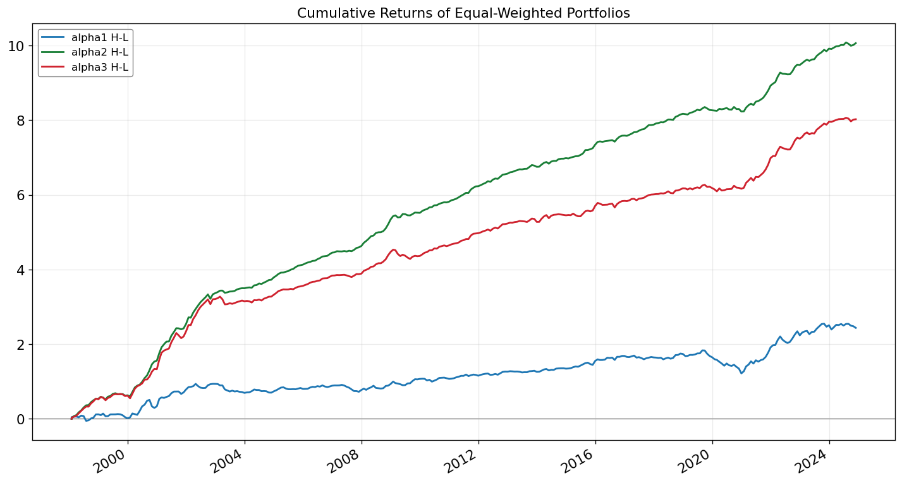

三路信号叠在同一张图上，横轴零线是盈亏分界。换 `weight` 就换一张：

```python
bt.plot("long_short", weight="VW")
```

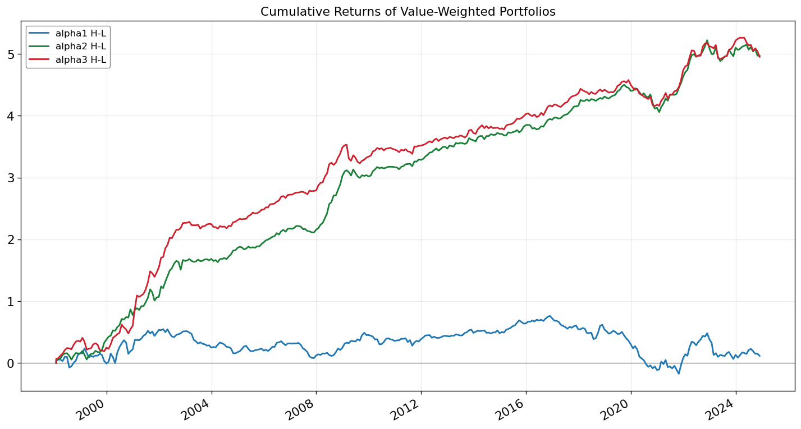

### 分位结构图：`plot("deciles")`

分位图一次只看一路信号——十个分位走色阶，多空腿用高亮色单独强调。`signal=` 决定画哪一路：

```python
bt.plot("deciles", signal="alpha1")
```

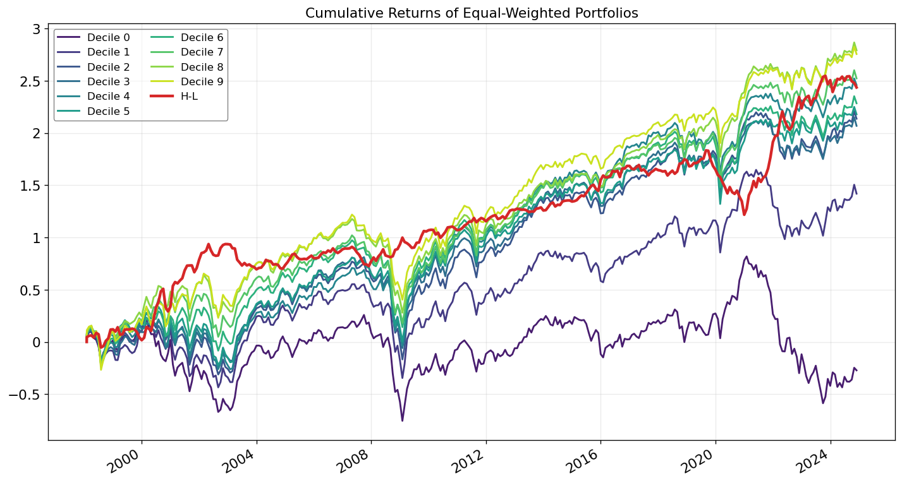

```python
bt.plot("deciles", signal="alpha2")
```

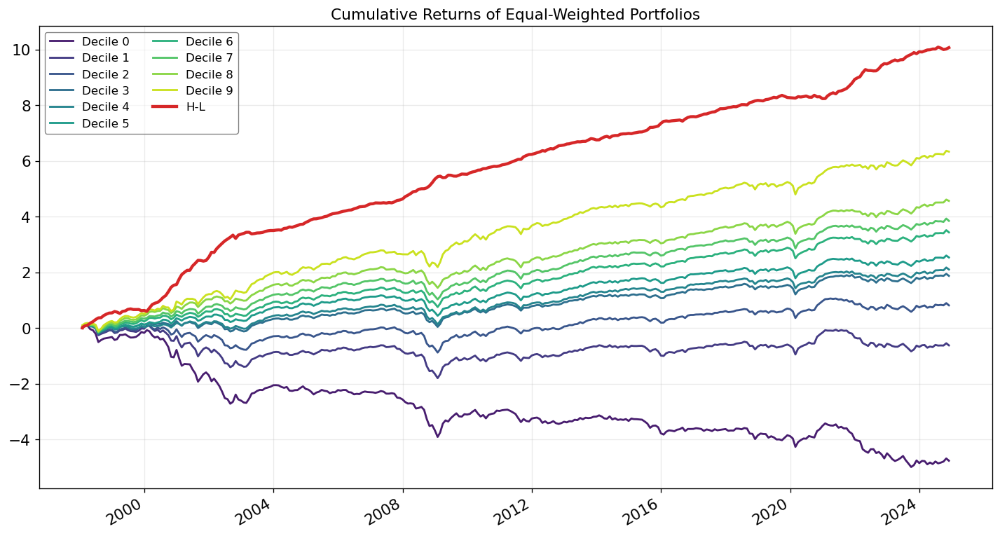

```python
bt.plot("deciles", signal="alpha3")
```

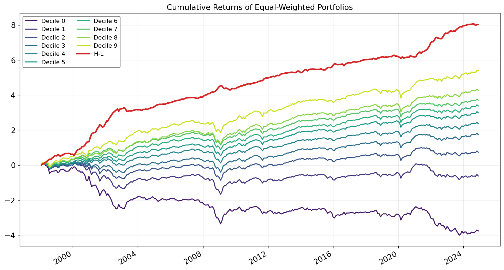

两个参数同时给出，就定位到「某一路信号 × 某一套加权」：

```python
bt.plot("deciles", signal="alpha1", weight="VW")
```

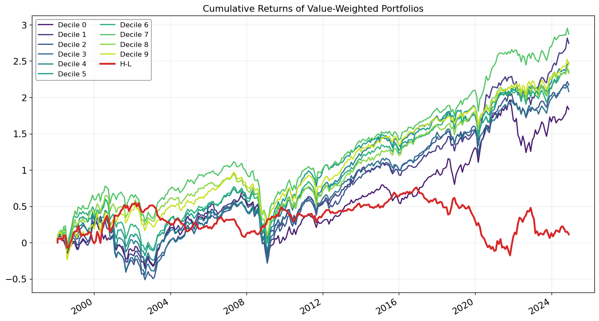

```python
bt.plot("deciles", signal="alpha2", weight="VW")
```

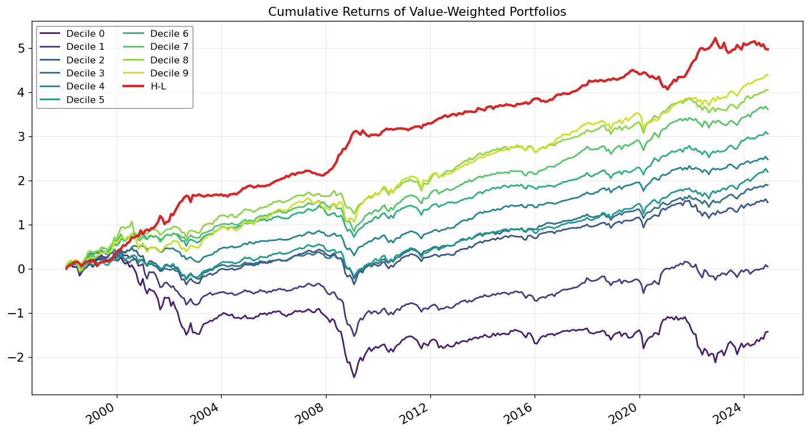

```python
bt.plot("deciles", signal="alpha3", weight="VW")
```

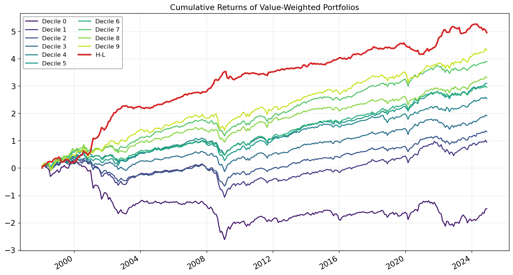

!!! note "图表类型只有一种"

    包内注册的图表类型只有累计对数收益曲线。`long_short` 与 `deciles` 是同一种图的两个预设，
    区别只在画哪些桶（`buckets`）与怎么配色（`color_mode`）。预设覆盖不到时，样式关键字可以
    直接透传给 `ChartSpec`：

    ```python
    fig = bt.plot("long_short", show_title=False, legend_loc="lower right")
    fig.savefig("fig3.pdf", dpi=300)      # 返回的是原生 matplotlib Figure
    ```

### 逐期诊断：`ic` 与 `turnover`

中间产物原样保留，直接取用不必重跑：

```python
bt.ic.head()
```

```
signal_model       date        ic  count
      alpha1 1998-01-31  0.158774   2814
      alpha1 1998-02-28  0.029687   2800
      alpha1 1998-03-31  0.029393   2785
      alpha1 1998-04-30 -0.097187   2770
      alpha1 1998-05-31  0.115131   2753
```

`bt.turnover` 同为逐期长表，粒度是 `(signal_model, bucket, date)`。此外 `bt.returns`、
`bt.curves`、`bt.members`、`bt.aligned` 分别是逐期组合收益、曲线、分桶成分与对齐面板，
逐项说明见[产物与落盘](outputs.md#python-侧的产物)。

### 落盘：`save()`

一次写出上面所有的图与表。内存 DataFrame 输入时没有数据文件可作落点锚，因此必须显式给出目录：

```python
for path in bt.save("/path/to/data/outputs/"):
    print(path.name)
```

```
long_short_ew.png
long_short_vw.png
deciles_alpha1_ew.png
deciles_alpha2_ew.png
deciles_alpha3_ew.png
deciles_alpha1_vw.png
deciles_alpha2_vw.png
deciles_alpha3_vw.png
metrics.csv
turnover.csv
ic.csv
summary_metrics.csv
curves.feather
```

文件名逐段对应上面的调用：`deciles_alpha2_ew.png` 即 `plot("deciles", signal="alpha2", weight="EW")`
那张。图表数量因此是「策略对比图：加权方案数」加「分位图：信号数 × 加权方案数」，此处 2 + 3×2 = 8 张。

### 配置目录的等价写法

同一次回测写成四份 JSON，`alpholio run` 产出与上面逐值相同的图与表。目录内固定四个文件名，
缺任一即报错；`vars` 中定义的变量以 `${VAR}` 形式在路径里展开。

=== "input.json"

    三路信号指向同一个文件，只有 `column_map.alpha` 不同：

    ```json
    {
      "vars": { "DATA": "/path/to/your/data" },
      "frequency": "monthly",
      "prices": {
        "path": "${DATA}/panel.parquet",
        "column_map": { "date": "date", "id": "id", "cap": "cap" },
        "restrict_to_signal_assets": true
      },
      "signals": [
        {
          "name": "alpha1",
          "path": "${DATA}/panel.parquet",
          "column_map": { "date": "date", "id": "id", "alpha": "alpha1", "fwd_ret": "fwd_ret" }
        },
        {
          "name": "alpha2",
          "path": "${DATA}/panel.parquet",
          "column_map": { "date": "date", "id": "id", "alpha": "alpha2", "fwd_ret": "fwd_ret" }
        },
        {
          "name": "alpha3",
          "path": "${DATA}/panel.parquet",
          "column_map": { "date": "date", "id": "id", "alpha": "alpha3", "fwd_ret": "fwd_ret" }
        }
      ],
      "references": [],
      "calendar": {
        "first_rebalance": null,
        "last_rebalance": null,
        "rebalance_freq": 1,
        "source": "signals",
        "auto_stride": true
      }
    }
    ```

=== "engine.json"

    `forward_return.horizon` 为必填项，此处单位是自然月：

    ```json
    {
      "n_buckets": 10,
      "min_names": 20,
      "holding_days": null,
      "weights": ["ew", "vw"],
      "include_references": false,
      "long_short": { "enabled": true, "label": "H-L", "reverse": false },
      "forward_return": { "horizon": 1, "source": "signals", "clip_lower": null }
    }
    ```

=== "analyzer.json"

    ```json
    {
      "metrics": ["ann_ret", "cagr", "ann_vol", "sharpe", "max_drawdown", "total_equity"],
      "periods_per_year": null,
      "trading_days_per_year": 252.0,
      "risk_free_rate": 0.0,
      "diagnostics": { "turnover": true, "ic": true, "ic_min_names": 20 },
      "curves": { "clip_lower": -0.99, "shared_origin": true },
      "vol_rescale": { "enabled": false, "reference": null, "min_periods": 20 }
    }
    ```

=== "visualizer.json"

    两个图表配置分别对应 `plot("long_short")` 与 `plot("deciles")`，`tables` 三项对应
    `save()` 写出的三份 CSV：

    ```json
    {
      "output_dir": "${DATA}/outputs",
      "export_returns": true,
      "charts": [
        {
          "name": "long_short",
          "type": "cumulative_log_return",
          "buckets": ["H-L"],
          "color_mode": "palette",
          "show_baseline": true
        },
        {
          "name": "deciles",
          "type": "cumulative_log_return",
          "buckets": ["0", "1", "2", "3", "4", "5", "6", "7", "8", "9", "H-L"],
          "color_mode": "gradient",
          "legend_ncol": 2
        }
      ],
      "tables": [
        {
          "name": "metrics",
          "type": "summary",
          "percent_columns": ["ann_ret", "cagr", "ann_vol", "max_drawdown", "turnover"],
          "decimals": 4
        },
        { "name": "turnover", "type": "turnover" },
        { "name": "ic", "type": "ic" }
      ],
      "style": { "figsize": [12.0, 6.5], "dpi": 120 }
    }
    ```

```bash
alpholio run --config-dir configs/
alpholio run --config-dir configs/ --no-render     # 只算不出图
alpholio run --config-dir configs/ --quiet         # 不打印摘要，仅列出落盘文件
```

---

## 日频：单路 alpha 配两条基准

日频面板每 5 个交易日调仓一次，区间 2021-01-04 至 2025-12-24 共 250 个调仓期，每期约 4,800 只。
基准两条，等权与市值加权各一条，与两套加权方案配对。

### 输入长什么样

三张表。信号表每个 `(date, id)` 一行，自带已算好的实现收益：

```
date       datetime64[ns]
id                  int64
alpha             float64
fwd_ret           float64
```

```
      date    id     alpha  fwd_ret
2021-01-04 10026 -0.231237 0.005321
2021-01-04 10028  2.021429 0.120623
2021-01-04 10032 -0.020332 0.081269
2021-01-04 10044 -0.523864 0.102439
2021-01-04 10051 -0.141912 0.051826
```

价格面板逐日，提供交易日历与市值，区间比信号长得多，超出部分由 `first_rebalance` 与信号自身的
日期范围裁掉：

```
date       datetime64[ns]
id                  int64
close             float64
cap               float64
```

基准序列两列即可，日期与该日收益率：

```
      date       ret
1992-01-02  0.000610
1992-01-03  0.006576
1992-01-06 -0.000601
```

!!! note "`fwd_ret` 与 `alpha` 可以走不同的价格口径"

    信号自带 `fwd_ret` 时工具包直接采用，不做任何再加工。该列若按未复权 `close` 计算，拆股与
    缩股会让它跳变：实测一例中某只股票反向缩股 1:100，价格口径据此算出 +25931% 的单只收益，
    在 493 只的等权桶里单独贡献 +64% 的组合收益，使该期多空腿从 −1.76% 变成 −141.17%。
    复权口径 `prod(1 + 日收益) − 1` 天然免疫拆股与除息。口径正确与否在包的职责之外。

### 起一次回测

信号与基准用内存表，价格面板几百 MB 交给包按需读取，两种形态在同一次调用里混用：

```python
import pandas as pd
import alpholio as alp

bt = alp.backtest(
    signals={"alpha1": pd.read_feather("/path/to/data/alpha1.feather")},
    prices="/path/to/data/prices.feather",
    price_columns={"date": "date", "id": "id", "close": "close", "cap": "cap"},
    horizon=5,
    first_rebalance="2021-01-04",
    references={
        "SPX_EW": pd.read_csv("/path/to/data/spx_ew.csv", parse_dates=["date"]),
        "SPX_VW": pd.read_csv("/path/to/data/spx_vw.csv", parse_dates=["date"]),
    },
    reference_frequency="daily",
)
bt
```

```
BacktestResult(signals=['alpha1'], horizon=5, n_buckets=10, weights=['EW', 'VW'], periods=250)
signal_model bucket weight  n_periods  ann_ret   cagr  ann_vol  sharpe  max_drawdown  total_equity  turnover  ic_mean
      SPX_EW    REF     EW        250   0.1259 0.1176   0.1699  0.7408       -0.1932        1.7360       NaN      NaN
      SPX_EW    REF     VW        250   0.1259 0.1176   0.1699  0.7408       -0.1932        1.7360       NaN      NaN
      SPX_VW    REF     EW        250   0.1559 0.1520   0.1679  0.9284       -0.2333        2.0175       NaN      NaN
      SPX_VW    REF     VW        250   0.1559 0.1520   0.1679  0.9284       -0.2333        2.0175       NaN      NaN
      alpha1    H-L     EW        250   0.0923 0.0711   0.2153  0.4288       -0.4202        1.4060    0.2648   0.0291
      alpha1    H-L     VW        250   0.1714 0.1342   0.3024  0.5670       -0.3767        1.8676    0.2648   0.0291
```

基准以 `bucket="REF"`、`signal_model=` 基准名进入结果表。`reference_frequency="daily"` 表示这两条
序列是日收益，需按持有期复利后再与调仓日历对齐；已折算好的周期收益填 `"period"`。

三处没有写、由数据推出来的默认值：

| 推导项 | 取值 | 依据 |
|---|---|---|
| `rebalance_freq` | 5，等于 `horizon` | 缺省取同值，相邻持有窗口首尾相接 |
| `weights` | `["ew", "vw"]` | 价格面板带 `cap` 列 |
| `forward_return_source` | `"signals"` | 信号表自带 `fwd_ret`，优先于由 `close` 推算 |

信号只在调仓日落盘，原生间隔已是 5 个交易日，`auto_stride` 识别到后不再二次抽稀。
规则详见[核心概念](concepts.md#按数据推导的默认值)。

### 指标表：`summary()`

`bucket` 接受列表，多空腿与基准一次取出：

```python
bt.summary(bucket=["H-L", "REF"]).round(4)
```

```
signal_model bucket weight  n_periods  ann_ret   cagr  ann_vol  sharpe  max_drawdown  total_equity  turnover  ic_mean
      SPX_EW    REF     EW        250   0.1259 0.1176   0.1699  0.7408       -0.1932        1.7360       NaN      NaN
      SPX_EW    REF     VW        250   0.1259 0.1176   0.1699  0.7408       -0.1932        1.7360       NaN      NaN
      SPX_VW    REF     EW        250   0.1559 0.1520   0.1679  0.9284       -0.2333        2.0175       NaN      NaN
      SPX_VW    REF     VW        250   0.1559 0.1520   0.1679  0.9284       -0.2333        2.0175       NaN      NaN
      alpha1    H-L     EW        250   0.0923 0.0711   0.2153  0.4288       -0.4202        1.4060    0.2648   0.0291
      alpha1    H-L     VW        250   0.1714 0.1342   0.3024  0.5670       -0.3767        1.8676    0.2648   0.0291
```

一条 `references` 会对**每个**加权方案各复制一行，因此 `SPX_EW` 在 EW 与 VW 两行上取值相同——
基准序列本身与组合的加权方案无关。基准行不参与换手与 IC，两列记 NaN。

只给 `weight` 时得到该加权方案下的全部桶，分位与基准同表：

```python
bt.summary(weight="EW").round(4)
```

```
signal_model bucket weight  n_periods  ann_ret    cagr  ann_vol  sharpe  max_drawdown  total_equity  turnover  ic_mean
      SPX_EW    REF     EW        250   0.1259  0.1176   0.1699  0.7408       -0.1932        1.7360       NaN      NaN
      SPX_VW    REF     EW        250   0.1559  0.1520   0.1679  0.9284       -0.2333        2.0175       NaN      NaN
      alpha1      0     EW        250  -0.0772 -0.1237   0.3308 -0.2334       -0.8023        0.5195    0.2848   0.0291
      alpha1      1     EW        250   0.0337 -0.0002   0.2599  0.1296       -0.5407        0.9989    0.4345   0.0291
      alpha1      2     EW        250   0.0809  0.0611   0.2074  0.3900       -0.3384        1.3419    0.5317   0.0291
      alpha1      3     EW        250   0.0938  0.0820   0.1723  0.5441       -0.2618        1.4782    0.5942   0.0291
      alpha1      4     EW        250   0.0903  0.0821   0.1502  0.6011       -0.2471        1.4790    0.6254   0.0291
      alpha1      5     EW        250   0.1006  0.0931   0.1512  0.6654       -0.2133        1.5551    0.6342   0.0291
      alpha1      6     EW        250   0.0990  0.0902   0.1584  0.6253       -0.1989        1.5347    0.6136   0.0291
      alpha1      7     EW        250   0.1164  0.1068   0.1718  0.6775       -0.2016        1.6545    0.5641   0.0291
      alpha1      8     EW        250   0.1145  0.0990   0.1996  0.5738       -0.3021        1.5974    0.4516   0.0291
      alpha1      9     EW        250   0.0151 -0.0200   0.2652  0.0570       -0.5282        0.9045    0.2545   0.0291
      alpha1    H-L     EW        250   0.0923  0.0711   0.2153  0.4288       -0.4202        1.4060    0.2648   0.0291
```

分位序号与 `ann_ret` 的 Spearman 秩相关为 0.527：单调性主要由低分位一侧贡献，最高分位 D9 回落到
1.51%，低于 D2 至 D8 的任何一档。多空腿的收益因此几乎全部来自空头腿。

### 多空腿对比图：`plot("long_short", signals=[...])`

`long_short` 预设默认把所有基准都画上。等权组合应配等权指数，因此用 `signals` 白名单挑出这张图
该有的那条：

```python
bt.plot("long_short", weight="EW", signals=["alpha1", "SPX_EW"])
```

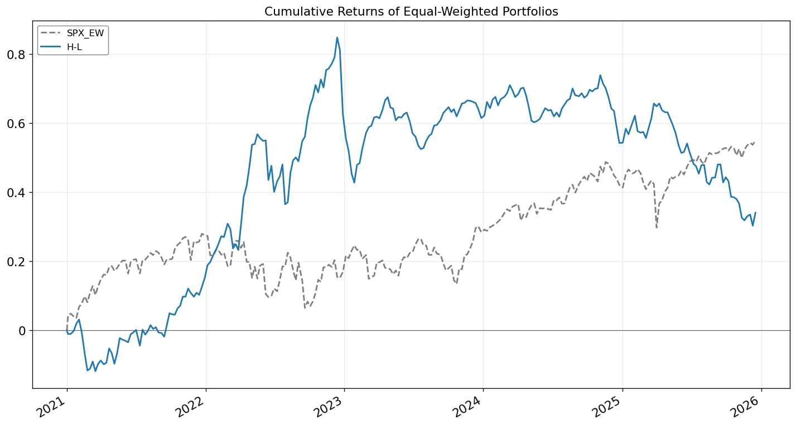

虚线是基准，样式走 `style.reference_color` 与 `style.reference_linestyle`。换成市值加权那套：

```python
bt.plot("long_short", weight="VW", signals=["alpha1", "SPX_VW"])
```

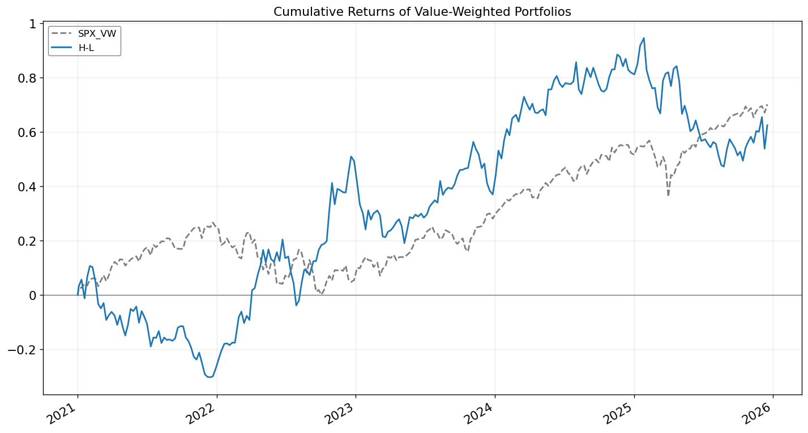

`signals` 白名单对策略信号与基准名同时生效，因此参与该图的策略必须一并列出。留空则两条基准同图，
适合只看指数之间差异的场合。

### 分位结构图：`plot("deciles")`

只有一路信号时不必写 `signal=`：

```python
bt.plot("deciles")
```

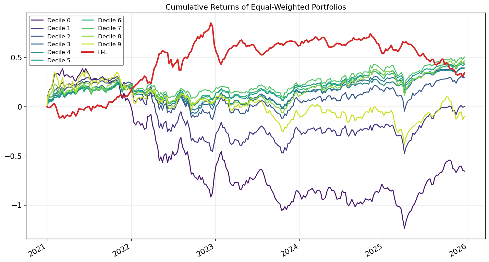

```python
bt.plot("deciles", weight="VW")
```

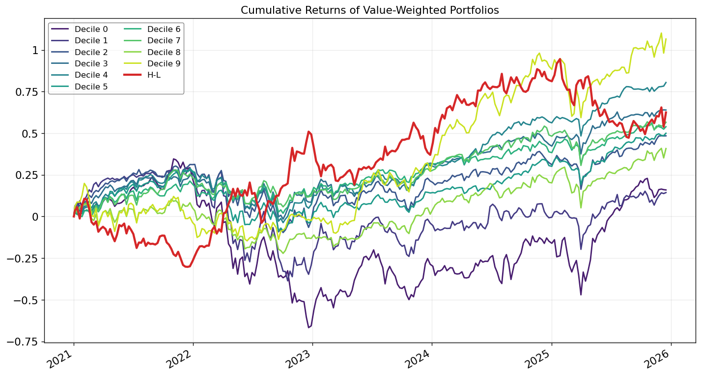

分位图的桶列表不含 `REF`，基准因此不会出现在这两张图上。

### 逐期诊断与落盘

```python
bt.ic.head()
```

```
signal_model       date        ic  count
      alpha1 2021-01-04  0.008399   4446
      alpha1 2021-01-11 -0.034371   4452
      alpha1 2021-01-19  0.059905   4452
      alpha1 2021-01-26  0.060289   4496
      alpha1 2021-02-02 -0.000085   4349
```

```python
for path in bt.save("/path/to/data/outputs/"):
    print(path.name)
```

```
long_short_ew.png
long_short_vw.png
deciles_ew.png
deciles_vw.png
metrics.csv
turnover.csv
ic.csv
summary_metrics.csv
curves.feather
```

单信号时分位图不加信号名后缀，文件名为 `deciles_{weight}.png`。

!!! warning "`save()` 走的是预设，不带 `signals` 白名单"

    落盘的 `long_short_ew.png` 上两条基准都在，与上面按加权配对的那两张不同。要让落盘结果也按
    加权配对，用下面的配置目录——两个同名 `long_short` 配置按 `weights` 分开，各自限定 `signals`。

### 配置目录的等价写法

=== "input.json"

    基准在 `references` 中声明，`frequency` 取 `daily` 表示该序列是日收益：

    ```json
    {
      "vars": { "DATA": "/path/to/your/data" },
      "frequency": "daily",
      "prices": {
        "path": "${DATA}/prices.feather",
        "column_map": { "date": "date", "id": "id", "close": "close", "cap": "cap" },
        "restrict_to_signal_assets": true
      },
      "signals": [
        {
          "name": "alpha1",
          "path": "${DATA}/alpha1.feather",
          "column_map": { "date": "date", "id": "id", "alpha": "alpha", "fwd_ret": "fwd_ret" }
        }
      ],
      "references": [
        {
          "name": "SPX_EW",
          "path": "${DATA}/spx_ew.csv",
          "column_map": { "date": "date", "ret": "ret" },
          "frequency": "daily"
        },
        {
          "name": "SPX_VW",
          "path": "${DATA}/spx_vw.csv",
          "column_map": { "date": "date", "ret": "ret" },
          "frequency": "daily"
        }
      ],
      "calendar": {
        "first_rebalance": "2021-01-04",
        "last_rebalance": null,
        "rebalance_freq": 5,
        "source": "signals",
        "auto_stride": true
      }
    }
    ```

=== "engine.json"

    `reference_lag` 为 1 表示基准的复利窗口从锚点次日起算，与持仓对齐：

    ```json
    {
      "n_buckets": 10,
      "min_names": 20,
      "holding_days": null,
      "weights": ["ew", "vw"],
      "include_references": true,
      "reference_lag": 1,
      "long_short": { "enabled": true, "label": "H-L", "reverse": false },
      "forward_return": { "horizon": 5, "source": "signals", "clip_lower": null }
    }
    ```

=== "analyzer.json"

    与月频例子相同：

    ```json
    {
      "metrics": ["ann_ret", "cagr", "ann_vol", "sharpe", "max_drawdown", "total_equity"],
      "periods_per_year": null,
      "trading_days_per_year": 252.0,
      "risk_free_rate": 0.0,
      "diagnostics": { "turnover": true, "ic": true, "ic_min_names": 20 },
      "curves": { "clip_lower": -0.99, "shared_origin": true },
      "vol_rescale": { "enabled": false, "reference": null, "min_periods": 20 }
    }
    ```

=== "visualizer.json"

    前两个图表配置与上面两次 `plot("long_short", weight=..., signals=[...])` 一一对应：

    ```json
    {
      "output_dir": "${DATA}/outputs",
      "export_returns": true,
      "charts": [
        {
          "name": "long_short",
          "type": "cumulative_log_return",
          "buckets": ["H-L", "REF"],
          "weights": ["EW"],
          "signals": ["alpha1", "SPX_EW"],
          "color_mode": "palette",
          "show_baseline": true
        },
        {
          "name": "long_short",
          "type": "cumulative_log_return",
          "buckets": ["H-L", "REF"],
          "weights": ["VW"],
          "signals": ["alpha1", "SPX_VW"],
          "color_mode": "palette",
          "show_baseline": true
        },
        {
          "name": "deciles",
          "type": "cumulative_log_return",
          "buckets": ["0", "1", "2", "3", "4", "5", "6", "7", "8", "9", "H-L"],
          "color_mode": "gradient",
          "legend_ncol": 2
        }
      ],
      "tables": [
        {
          "name": "metrics",
          "type": "summary",
          "percent_columns": ["ann_ret", "cagr", "ann_vol", "max_drawdown", "turnover"],
          "decimals": 4
        },
        { "name": "turnover", "type": "turnover" },
        { "name": "ic", "type": "ic" }
      ],
      "style": { "figsize": [12.0, 6.5], "dpi": 120 }
    }
    ```

两个图表配置同名且 `weights` 互不重叠，产出的 `long_short_ew.png` 与 `long_short_vw.png`
不会互相覆盖。

```bash
alpholio run --config-dir configs/
```

## 下一步

- [核心概念](concepts.md)：两条入口的关系、三份契约与扩展点
- [产物与落盘](outputs.md)：落点规则、表的过滤与百分比换算
- [数学口径](math.md)：每个指标的确切公式与失真条件
- [Python API 参考](../reference/api.md)：`backtest()` 逐参数说明与结果对象
